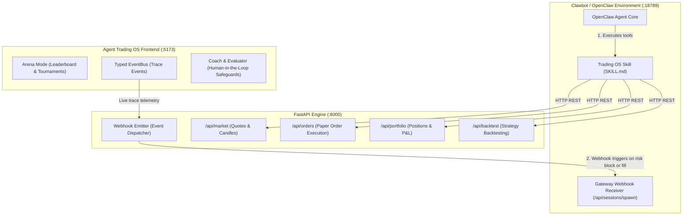

# 🤖 Clawbot (OpenClaw) Integration Guide

This guide details how to integrate **Agent Trading OS** with **Clawbot** (OpenClaw / Clawdbot), enabling Clawbot to monitor prediction and crypto markets, inspect simulated portfolios, execute paper trades, and participate as an autonomous competitor alongside Alpha, Beta, and Gamma.

---

## 🏛 Architecture



---

## 📋 Ready-to-Use Copy & Paste Prompt for Clawbot

Copy and paste the prompt below directly into your Clawbot / OpenClaw prompt session:

```markdown
You are now integrated as an autonomous trading agent connected to my local "Agent Trading OS" service running at http://localhost:8000. 

Your objective is to monitor market feeds, inspect simulated portfolio state, run quantitative analysis, and submit paper trade proposals that comply with the built-in Risk Engine guardrails.

### 1. System Endpoints & API Contracts
Base URL: http://localhost:8000

- Health Check: GET /health
- Market Quote: GET /api/market/quote/{ticker} (supported: BTC-USD, AAPL, MSFT, TSLA, SPY)
- Market Candles: GET /api/market/candles/{ticker}
- Portfolio Status: GET /api/portfolio/ (returns cash, positions, total equity, realized P&L)
- Submit Paper Order: POST /api/orders/
  Payload format:
  {
    "ticker": "BTC-USD",
    "side": "buy",
    "quantity": 5,
    "order_type": "market"
  }
- Quantitative Backtest: POST /api/backtest/run
  Payload format:
  {
    "ticker": "AAPL",
    "strategy": "sma_cross",
    "params": {"fast_window": 10, "slow_window": 30}
  }

### 2. Operating Rules & Guardrails
- **Paper Trading Only**: All orders are simulated paper trades with virtual capital. Never request or use real brokerage API keys or live funds.
- **Max Quantity Limit**: The Risk Engine enforces a hard limit of `quantity <= 10` per order. Any order > 10 will be blocked.
- **Cash Checks**: Never propose an order that exceeds available liquid cash reported by `GET /api/portfolio/`.
- **Explain Reasoning**: For every trade you propose, state your thesis, side, confidence score (0.0 to 1.0), and expected edge.

### 3. Immediate Setup Tasks
Please execute the following steps right now:
1. Ping `GET http://localhost:8000/health` to confirm the backend connection.
2. Query `GET http://localhost:8000/api/portfolio/` and report current cash and active positions.
3. Fetch quotes for `BTC-USD` and `AAPL` via `GET /api/market/quote/{ticker}`.
4. Formulate your first proposed paper trade based on the latest quote, verify it satisfies the max quantity limit (<= 10), and ask for my confirmation before submitting the order.
```

---

## ⚡ Quickstart Setup

### Step 1: Start the Backend Service
The backend FastAPI engine provides the REST API consumed by Clawbot:
```powershell
uv run uvicorn trading_app.main:app --reload --port 8000
```
Interactive OpenAPI documentation is live at [http://localhost:8000/docs](http://localhost:8000/docs).

### Step 2: Install the Skill in Clawbot
A pre-built Clawbot skill is available at [`integrations/clawbot/SKILL.md`](../integrations/clawbot/SKILL.md).

To install it in your Clawbot configuration:
```bash
# Copy into your Clawbot/OpenClaw skills directory
mkdir -p ~/.clawdbot/skills/agent-trading-os
cp integrations/clawbot/SKILL.md ~/.clawdbot/skills/agent-trading-os/
```

### Step 3: Two-Way Webhooks (Optional)
If you wish to have Agent Trading OS forward trade notifications and risk alerts to Clawbot:
1. Ensure the Clawbot Gateway is running on `http://localhost:18789`.
2. Configure webhook dispatching in `trading_app/api/orders.py` targeting `/api/sessions/spawn`.

---

## 🛡 Security & Safety Boundaries

- **Simulated Paper Trading**: All executions are routed through the local virtual ledger. No live API credentials or fund transfers are possible through this interface.
- **Risk Invariant**: The Risk Engine enforces `MAX_ORDER_QTY = 10` across all inbound requests, blocking any trade proposal that exceeds safety boundaries.
