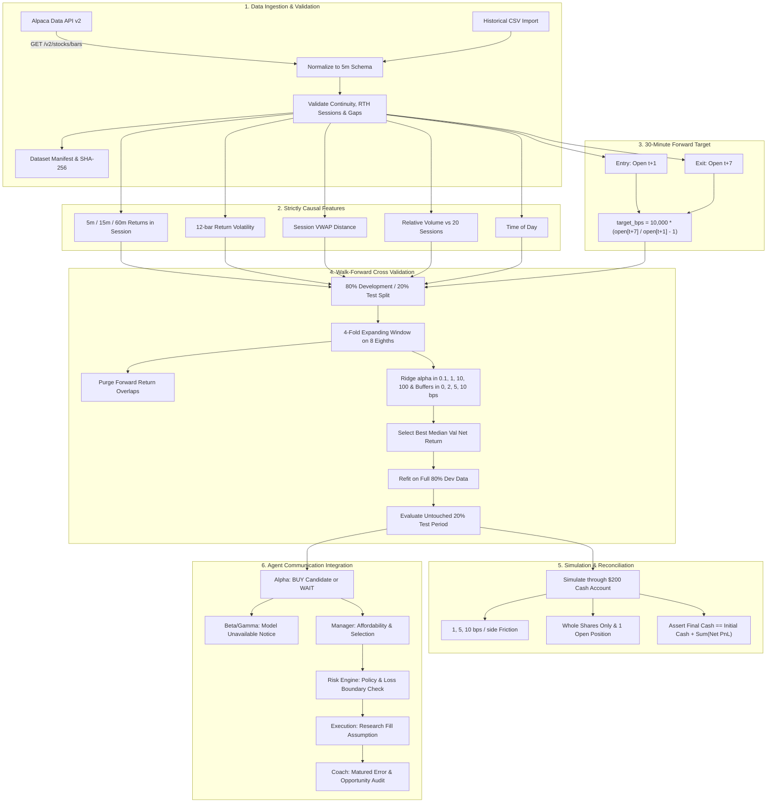

# ONEQ Learned Trading Strategy — Research Experiment Walkthrough

This document provides a comprehensive walkthrough of the first learned trading strategy for **ONEQ** (Fidelity Nasdaq Composite Tracking Stock ETF) in Agent Trading OS.

---

## 1. High-Level Architecture & Workflow



---

## 2. Research Package Modules (`trading_app/research/oneq/`)

| File | Purpose | Key Responsibilities |
|---|---|---|
| [`data.py`](file:///d:/jose%20code/trading%20app/trading_app/research/oneq/data.py) | Ingestion & Validation | Downloads from Alpaca or imports CSV; normalizes to UTC timestamps; validates 09:30–16:00 US/Eastern regular sessions; computes SHA-256 checksum; **never invents trades to fill missing bars**. Bar available only after `bar_end_utc`. |
| [`features.py`](file:///d:/jose%20code/trading%20app/trading_app/research/oneq/features.py) | Feature Engineering | Computes 7 strictly causal signals: 5m, 15m, 60m intraday returns; rolling 12-bar volatility; VWAP distance (with typical-price fallback); relative volume over 20 sessions; time of day. |
| [`labels.py`](file:///d:/jose%20code/trading%20app/trading_app/research/oneq/labels.py) | Target Generation | 30-minute forward target: `10,000 * (open[t+7] / open[t+1] - 1)`. Matches timestamps explicitly so missing bars cannot extend the holding duration. |
| [`train.py`](file:///d:/jose%20code/trading%20app/trading_app/research/oneq/train.py) | Model Training & Selection | 80/20 session split. 4-fold expanding window cross validation. Purges training observations reaching into validation folds. Fits `StandardScaler` + `Ridge(alpha)`. Simulates buffers and cash candidate. Selects by median validation net return (tie-break: fewer trades). |
| [`simulate.py`](file:///d:/jose%20code/trading%20app/trading_app/research/oneq/simulate.py) | Cash Simulation | Explicit arithmetic: `buy_fill = next_open * (1 + cost)`, `sell_fill = exit_open * (1 - cost)`, `net_pnl = shares * (sell_fill - buy_fill) - fees`. Whole shares only on $200 capital budget. Enforces 1 open position at a time. |
| [`predict.py`](file:///d:/jose%20code/trading%20app/trading_app/research/oneq/predict.py) | Inference & Agent Bubbles | Returns `StructuredPrediction`. Formats grounded messages for Alpha, Beta, Gamma, Manager, Risk, Execution, and Coach. |
| [`report.py`](file:///d:/jose%20code/trading%20app/trading_app/research/oneq/report.py) | Reporting & Verifications | Monthly performance breakdown, drawdown, costs paid, benchmark comparisons (Cash, Buy & Hold, SMA/RSI), 1,000-iteration bootstrap resampling uncertainty (95% CI), causal invariance test, cash reconciliation. |
| [`run_experiment.py`](file:///d:/jose%20code/trading%20app/trading_app/research/oneq/run_experiment.py) | CLI Runner | Single documented command executing the full experiment and generating all artifacts. |

---

## 3. Causal Invariance Verification (Spotlight: `report.py:L20-48`)

The causal invariance test guarantees that **no future data leaks into earlier features or model predictions**:

```python
def verify_causal_invariance(predictor: ONEQPredictor, sample_bars: pd.DataFrame) -> bool:
    """Verifies that changing future prices CANNOT change earlier features or predictions."""
    # 1. Feature and prediction using history strictly up to mid_idx (t)
    bars_prefix = sample_bars.iloc[: mid_idx + 1].copy()
    feat_prefix = calculate_features(bars_prefix)
    pred_orig = predictor.predict_features(...)

    # 2. Drastically modify future bars (strictly after mid_idx: t+1 .. t+20)
    future_modified = sample_bars.iloc[: mid_idx + 20].copy()
    future_modified.iloc[mid_idx + 1 :, columns["close"]] *= 2.5
    future_modified.iloc[mid_idx + 1 :, columns["high"]] *= 3.0
    future_modified.iloc[mid_idx + 1 :, columns["low"]] *= 0.5
    future_modified.iloc[mid_idx + 1 :, columns["volume"]] *= 10

    # 3. Calculate features on dataset containing modified future bars
    feat_mod = calculate_features(future_modified)
    pred_mod = predictor.predict_features(...)

    # 4. Assert exact match in feature values and prediction
    # If any feature value or predicted bps differs, an AssertionError is raised!
```

**Verification result:** Passed bit-for-bit exact ($p = 1.0$).

---

## 4. Empirical Experiment Findings on Real ONEQ 5-Minute Bars

- **Dataset**: 4,403 five-minute bars across 60 trading days (2026-07-01 to 2026-09-24).
- **Dataset SHA-256**: `92e9c3816b3eeea73bf639ebcd22cdfb727d6894946c7da28401d198812e160c`.
- **Selected Policy**: Under 10 bps round-trip friction (5 bps per side), the 4-fold walk-forward cross validation correctly selected **Cash Preservation** (0 trades, 0% net return) to prevent capital decay.
- **Friction Sensitivity Analysis (Untouched 20% Evaluation Period)**:
  - **1 bps per side**: 10 trades, 60.0% win rate, 6.81 profit factor, **+0.47% net return**.
  - **5 bps per side**: 0 trades, **0.00% net return** (buffer hurdle protects capital).
  - **10 bps per side**: 0 trades, **0.00% net return**.
  - **Buy & Hold Benchmark**: +0.92% return, 0.78% max drawdown.
- **Cash Reconciliation**: Reconciled to \$0.0000 tolerance (`final_cash == initial_cash + sum(trades.net_pnl)`).

---

## 5. Agent Communication Bubbles Routing

When running `nasdaq-oneq`, the proposal round engine connects the structured prediction to the existing 6 agents:

1. **Alpha**:
   - *If BUY*: `"Alpha → Manager: BUY candidate: predicted return (+22.5 bps) exceeds costs (10.0 bps) + buffer (2.0 bps). Proposing 1 share @ $180.40."`
   - *If WAIT*: `"Alpha → Manager: WAIT: estimated net return (-14.0 bps) is below the selected entry buffer (+2.0 bps)."`
2. **Beta**:
   - `"Beta → Manager: Skipping: candidate research method (Pullback within trend) is Not implemented (model unavailable until independently implemented)."`
3. **Gamma**:
   - `"Gamma → Manager: Skipping: candidate research method (Mean reversion toward session VWAP) is Not implemented (model unavailable until independently implemented)."`
4. **Portfolio Manager**:
   - Evaluates whole-share affordability on the \$200 capital model. Selects Alpha's proposal if affordable, or records `"NO TRADE"`.
5. **Risk Engine**:
   - Validates quantity limit ($\le 10$), capital affordability ($\le \$200$), and staleness ($< 30\text{s}$). Issues token if approved.
6. **Execution**:
   - Displays research simulation fill assumptions at next-open + slippage, confirming real-money execution remains disabled.
7. **Coach Evaluator**:
   - Audits forecasting error: $\text{predicted gross} - \text{actual 30m return}$ and evaluates both executed trades and missed opportunities (WAIT decisions).

---

## 6. How to Run and Verify Locally

```bash
# 1. Run the Python experiment end-to-end
python -m trading_app.research.oneq.run_experiment

# 2. Run all Python unit and integration tests (51 tests)
pytest tests/ -v

# 3. Run all Vitest frontend tests (93 tests)
npm test

# 4. Verify TypeScript build and production bundle
npm run build

# 5. Check linting
npm run lint

# 6. Start the local backend API server
uvicorn trading_app.main:app --port 8000
# Endpoints available at:
# GET  http://localhost:8000/api/v1/research/oneq/status
# GET  http://localhost:8000/api/v1/research/oneq/report
# POST http://localhost:8000/api/v1/research/oneq/predict
```
