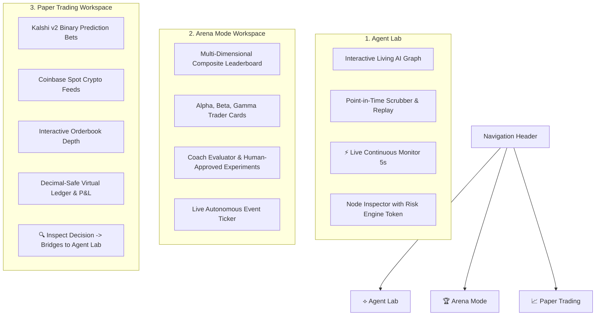

# Agent Trading OS — Comprehensive System Walkthrough

An advanced visual operating system and competitive multi-agent laboratory for autonomous AI trading agents. Agents paper-trade against live prediction markets (Kalshi) and spot crypto (Coinbase), supervised by a Portfolio Manager and Coach Evaluator, backed by a FastAPI engine, Graphify knowledge graph, and Clawbot (OpenClaw) integration.

---

## ⚡ Quickstart Commands

### 1. Frontend Web App (Agent Trading OS)
```powershell
cd "d:\jose code\trading app"

# Run automated Vitest test suite (63/63 tests passing)
npm test

# Build validation check (TypeScript + Vite)
npm run build

# Start local development server (launches browser on http://localhost:5173)
npm run dev -- --open
```

### 2. Backend Engine (FastAPI Service)
```powershell
# Run backend test suite (35/35 tests passing)
uv run pytest tests/ -v

# Start FastAPI server on port 8000
uv run uvicorn trading_app.main:app --reload --port 8000
```
- Interactive OpenAPI Docs: [http://localhost:8000/docs](http://localhost:8000/docs)

---

## 🏛 The Three Workspaces



---

## 🤖 The Competitor Agents & Supervision

| Agent | Role | Style & Philosophy | Simulated Bankroll | Strategy & Execution |
| :--- | :--- | :--- | :--- | :--- |
| **Trader Alpha** | Momentum | *"The market contains information."* | $10,000 | Orderbook depth imbalance (>1.35x), spread friction analysis, volume momentum breakouts. |
| **Trader Beta** | Fundamental Prob | *"Estimate true probability from first principles."* | $10,000 | Evaluates fair odds, requires a strict 5.0% edge hurdle, optimizes Brier score calibration. |
| **Trader Gamma** | Contrarian | *"Crowds overreact to transient sentiment."* | $10,000 | Fades extreme consensus implied odds (>80% or <20%) with asymmetric, convex upside. |
| **Portfolio Manager** | Supervisor | Capital allocation & risk balance | $50,000 | Enforces strict 15%–50% weight boundaries, detects consensus vs. divergence, routes approved orders to Risk Engine. |
| **Coach & Evaluator** | Auditor | Calibration & bias auditor | N/A | Tracks Brier score calibration, diagnoses overtrading, and proposes parameter experiments with **explicit human operator approval**. |

### Multi-Dimensional Composite Scoring Formula
$$ \text{Composite} = 0.25 \times \text{Return} + 0.20 \times (100 - \text{MaxDD}) + 0.20 \times (1 - 2 \cdot \text{Brier}) \times 100 + 0.15 \times \text{WinRate} + 0.10 \times \text{Edge} + 0.10 \times \text{Compliance} $$

---

## 📈 Real Market Data Feeds

1. **Kalshi v2 Prediction Markets**:
   - CFTC-regulated binary prediction contracts (`KXOAIANTH-40-ANTH`, `KXOAIANTH-40-OAI`, `KXELONMARS-99`).
   - Cached local proxy plugin in `vite.config.ts` prevents CORS issues and rate limits.
2. **Coinbase Spot Crypto**:
   - Real-time live quotes for `BTC-USD`, `ETH-USD`, and `SOL-USD`.
   - Streaming bid/ask normalization and 30-period interactive price charts.
3. **Decimal-Safe Paper Execution**:
   - Exact Kalshi taker fee formulas (`0.07 * contracts * price * (1 - price)`).
   - Strict short-selling prevention, position basis averaging, and cash reservation.

---

## 🤖 Clawbot (OpenClaw / Clawdbot) Integration

The platform includes full first-class support for integrating with **Clawbot (OpenClaw)**:

- **Integration Documentation**: [`docs/clawbot_integration.md`](./clawbot_integration.md)
- **Agent Skill Specification**: [`integrations/clawbot/SKILL.md`](../integrations/clawbot/SKILL.md)
- **Ready-to-Use Copy-Paste Prompt**:
  Allows Clawbot to immediately ping `/health`, inspect virtual cash and positions via `/api/portfolio/`, pull quotes via `/api/market/quote/{ticker}`, and propose paper trades that respect the built-in Risk Engine limit (`quantity <= 10`).

---

## 🧠 Graphify Codebase Knowledge Graph

The entire codebase is indexed as an AST knowledge graph:
- **733 Nodes**, **1,580 Edges**, **44 Communities**.
- Interactive Graph Visualizer: `graphify-out/graph.html`
- Callflow Tracking: `graphify-out/trading-app-callflow.html`
- Architectural Report: `graphify-out/GRAPH_REPORT.md`

```powershell
# Query the knowledge graph
graphify query "How does Portfolio Manager allocate capital to Trader Alpha?"

# Update graph after modifications (AST-only, zero API cost)
graphify update .
```

---

## ✅ Automated Test Suite Verification

### Vitest Frontend Tests (63 / 63 Passed)
```text
 ✓ src/__tests__/agents.test.ts (7 tests)
 ✓ src/__tests__/workflow.test.ts (20 tests)
 ✓ src/__tests__/competition.test.ts (11 tests)
 ✓ src/__tests__/replay.test.ts (7 tests)
 ✓ src/__tests__/paperTrading.test.ts (18 tests)

Test Files  5 passed (5)
     Tests  63 passed (63)
```

### Pytest Backend Tests (35 / 35 Passed)
```text
tests/test_api.py (11 tests passed)
tests/test_backtest.py (5 tests passed)
tests/test_portfolio.py (9 tests passed)
tests/test_strategies.py (10 tests passed)

Results: 35 passed in 1.52s
```

### Build & Static Analysis
- **TypeScript & Vite Build**: `npm run build` completed with 0 errors.
- **OxLint**: `npm run lint` completed with 0 errors.
- **Browser Live Session**: 0 console errors, clean 60fps React Flow canvas.
