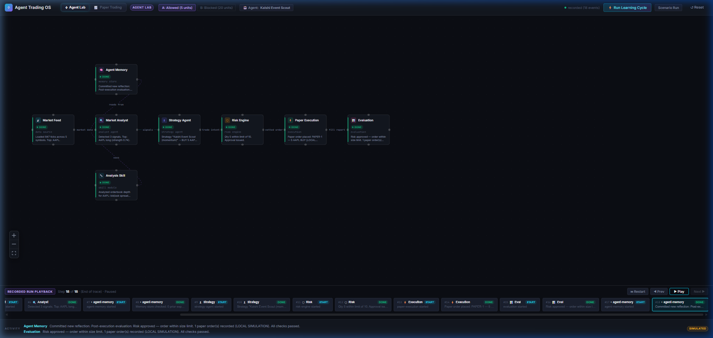
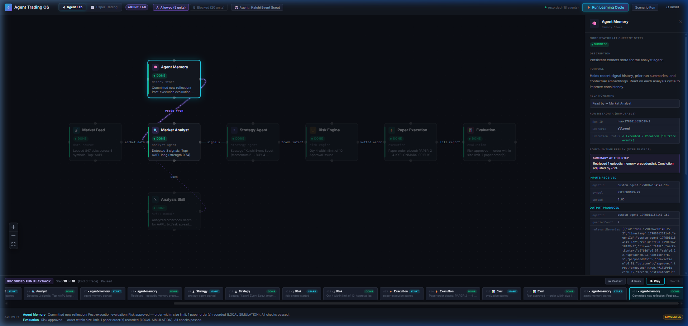
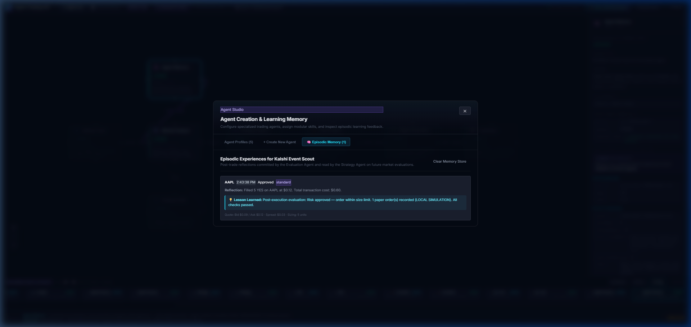

# Agent Trading OS — Milestone 5 Walkthrough: Agent Studio, Modular Skills & Episodic Learning Memory Loop

## 1. Quickstart Instructions

```bash
cd "d:\jose code\trading app"
npm install
npm test      # runs Vitest suite across all 4 test files (50 tests passing)
npm run build # production build validation (0 errors, clean bundle)
npm run dev   # launches dev server on http://localhost:5173
```

### Graphify Knowledge Graph Commands
```bash
# Update and inspect the codebase AST knowledge graph:
uv tool run --from graphifyy graphify extract . --code-only
uv tool run --from graphifyy graphify export html
```

---

## 2. Key Architecture & Milestone 5 Highlights

### A. Agent Studio & Training Registry
* **Agent Studio Modal**: Launched directly from the persistent TopBar via `[🤖 Agent: <Active Agent>]`.
* **Preset Profiles**:
  1. **Alpha Scalper** (Conservative Scalping): Size 2, Conviction 85%, Max Spread $0.02, Skills: `kalshi-spread-analyzer`, `orderbook-imbalance`.
  2. **Spread Arbitrageur** (Arbitrage): Size 5, Conviction 90%, Max Spread $0.01, Skills: `kalshi-spread-analyzer`, `regime-detector`.
  3. **Conservative Sentinel** (Defensive): Size 1, Conviction 95%, Max Spread $0.015, Skills: `kalshi-spread-analyzer`, `risk-vetting`.
  4. **Aggressive Breakout** (Momentum Trend): Size 8, Conviction 70%, Max Spread $0.05, Skills: `momentum-trend`, `volatility-breakout`.
* **Custom Agent Builder**:
  * Users can name an agent, select a strategy archetype, set target sizing (1-10 contracts), configure conviction threshold (50-99%), specify max spread tolerance ($0.005 - $0.10), assign modular skills, and enter custom instructions.
  * Persisted across browser reloads via `localStorage`.

### B. Modular Skills Architecture
* **`analysis-skill` Node Activated**: Executes assigned skills as pure deterministic functions:
  * `kalshi-spread-analyzer`: Evaluates bid/ask spread friction relative to contract value.
  * `momentum-trend`: Computes price velocity and directional persistence.
  * `orderbook-imbalance`: Assesses depth ratio between YES and NO resting orders.
  * `volatility-breakout`: Identifies rapid price boundary expansions.
  * `regime-detector`: Categorizes market conditions (Mean-Reverting vs. Trending).
* Emits structured `SkillExecutionOutput` events consumed by downstream analytical and strategy agents.

### C. Episodic Learning Memory Loop
* **`agent-memory` Node Activated**: Participates twice in each agent execution run:
  1. **Pre-Trade Memory Query**: Strategy Agent queries relevant historical precedents from episodic memory matching the ticker and market regime. If prior episodes suffered loss or high fee drag, the memory store down-weights conviction by -5% to -15%.
  2. **Post-Trade Reflection Commit**: Evaluation Agent inspects final execution, calculates net theoretical P&L, formulates structured takeaways, and commits a persistent `EpisodicMemoryItem`.
* **Learning Stats**: Tracks total runs, win rate, risk rejection rate, and precedent recall counts per agent profile.

### D. 8-Node Graph Execution Pipeline
When an agent runs in Agent Lab, the full 8-node pipeline executes synchronously and replays inspectably:
$$\text{Market Feed} \longrightarrow \text{Analysis Skill} \longrightarrow \text{Market Analyst} \longrightarrow \text{Agent Memory (Query)} \longrightarrow \text{Strategy Agent} \longrightarrow \text{Risk Engine} \longrightarrow \text{Paper Execution} \longrightarrow \text{Evaluation} \longrightarrow \text{Agent Memory (Commit)}$$

* Legacy tests and manual runs without an active agent smoothly fallback to the standard 6-stage pipeline, maintaining 100% backward compatibility.

### E. Graphify Knowledge Integration
* Complete project structure mapped into an AST knowledge graph via `graphify`:
  * **309 nodes, 726 edges, 12 communities** extracted.
  * Visual interactive map exported to `graphify-out/graph.html`.
  * Callflow visualization exported to `graphify-out/trading-app-callflow.html`.

---

## 3. Visual Demonstration & Screenshots

### A. Complete Replay Trace with Custom Agent & 8 Pipeline Nodes
Shows `Kalshi Event Scout` running an 18-event trace with all 8 nodes active in the graph canvas, including `Analysis Skill` and `Agent Memory`:



### B. Agent Memory Node Inspection (Precedent Query & Conviction Adjustment)
Selecting the `Agent Memory` node in the graph reveals the point-in-time inspector card, displaying retrieved precedent count, historical lessons, and conviction adjustment (-6%):



### C. Agent Studio — Episodic Memory History
Viewing the `🧠 Episodic Memory` tab in Agent Studio shows recorded post-execution reflections, lessons learned, transaction costs, and tags:



---

## 4. Automated Test Suite Results

All 50 tests pass across 4 test suites (`npm test`):

```
 RUN  v5.0.1 D:/jose code/trading app

 ✓ src/__tests__/agents.test.ts (7 tests) 11ms
 ✓ src/__tests__/workflow.test.ts (20 tests) 14ms
 ✓ src/__tests__/replay.test.ts (7 tests) 125ms
stdout | src/__tests__/paperTrading.test.ts > 7. Live Kalshi API Data Fetch Demonstration > successfully fetches real binary market data or honestly reports API limitation
✓ Live Kalshi Market Data: KXELONMARS-99 Bid: $0.09 / Ask: $0.12

 ✓ src/__tests__/paperTrading.test.ts (16 tests) 153ms

 Test Files  4 passed (4)
      Tests  50 passed (50)
   Start at  14:28:41
   Duration  749ms (transform 47%, tests 29%, import 16%, worker 8%)
```

---

## 5. Verification Checklist

- [x] Preset agents and custom agent profile creation with local storage persistence
- [x] Modular skill assignment and pure execution in `analysis-skill` node
- [x] Dual-stage episodic memory participation (pre-trade retrieval and post-trade reflection commit)
- [x] Conviction adaptation based on historical trade outcomes and spread friction
- [x] 8-stage interactive graph execution and step-by-step point-in-time replay
- [x] Dedicated inspector cards for Agent Memory and Analysis Skill
- [x] Zero regressions in Paper Trading workspace or Kalshi live data bridge
- [x] Graphify knowledge graph extraction (309 nodes, 726 edges, 12 communities)
